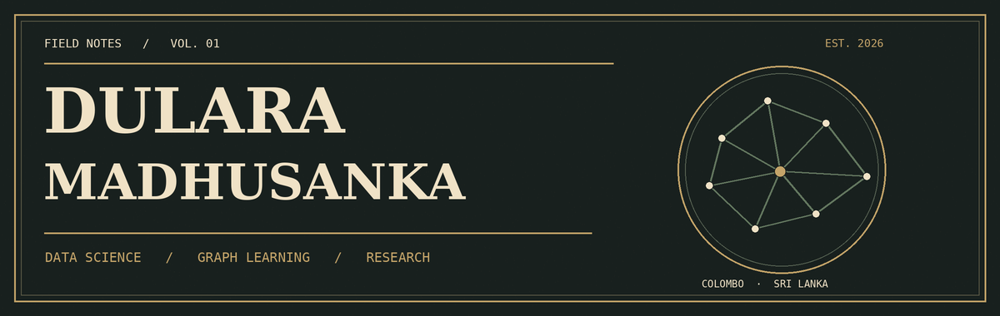

  

  

  <a href="https://dularamadhusanka.github.io/portfolio/#home">Portfolio</a> &nbsp;·&nbsp;
  <a href="https://linkedin.com/in/dulara-madusanka">LinkedIn</a> &nbsp;·&nbsp;
  <a href="mailto:dularamadusanka690@gmail.com">Email</a> &nbsp;·&nbsp;
  Colombo, Sri Lanka

---

### I. A note from the desk

I am a **Data Science undergraduate and AI Research Assistant at SLIIT**. I study how the difficulty and order of training examples affect deep learning, especially with **graph neural networks and curriculum learning**. My work centers on reproducible PyTorch experiments, careful evaluation, and learning under limited or noisy data.

Alongside research, I teach mathematics and enjoy turning difficult ideas into useful explanations.

### II. Research folio

| Year | Work | Note |
| :--- | :--- | :--- |
| 2026 | **Tag Entropy: A Structure-Agnostic Curriculum Learning Framework for Graph Neural Networks** | First author · MERCon 2026 · accepted, publication pending |
| 2026 | **Beyond Easy-to-Hard: Investigating Tag-Entropy-Based Training Order in Graph Neural Networks** | First author · IJCAI–ECAI GlobalSouthAI Workshop · accepted, publication pending |
| 2026 | **[Confusion-Aware Transfer Teacher Curriculum Learning Framework: Disentangling Scoring and Pacing Effects](https://arxiv.org/abs/2606.17706)** | Co-author · presented at the Global South ML Workshop, ICML 2026 |

Research themes: graph learning · curriculum design · difficulty scoring · robust evaluation

### III. Selected builds

| No. | Project | Inside the notebook |
| :--- | :--- | :--- |
| 01 | **[Entropy-based curriculum training](https://github.com/DularaMadhusanka/Curriculum-by-Masking)** | GPU-accelerated experiments with entropy-driven difficulty scoring and dynamic masking. |
| 02 | **[Conditional diffusion model](https://github.com/DularaMadhusanka/current_research)** | PyTorch image generation with classifier-free guidance and validated sampling. |
| 03 | **[Customer segmentation and lifetime value](https://github.com/DularaMadhusanka/rfm-customer-segmentation)** | Python, DuckDB, Power BI, and statistical tests for customer analytics. |
| 04 | **[Monte Carlo risk engine](https://github.com/DularaMadhusanka/monte-carlo-risk-engine)** · [live app](https://monte-carlo-risk-engine.streamlit.app/) | Student's t simulations, rolling backtests, and Kupiec POF validation. |
| 05 | **[Intelligent booking ecosystem](https://github.com/DS-02-G07-AI-ML-Project/ai-hotel-booking-system)** | Retrieval-augmented booking platform using FastAPI and ChromaDB. |

### IV. Tools of the trade

| For research | For building | For analysis |
| :--- | :--- | :--- |
| PyTorch · TensorFlow · GNNs · CNNs | Python · SQL · FastAPI · Docker · Git | DuckDB · Power BI · R · statistical testing |
| Curriculum learning · diffusion models | Linux · Streamlit · MongoDB | Monte Carlo · VaR/CVaR · DAX |

### V. The current chapter

**2025–present** · Undergraduate Research Assistant, AI Systems Research, SLIIT  
**2025–present** · Independent Mathematics Instructor  
**2024–2028** · BSc (Hons) in Information Technology, Data Science specialization, SLIIT

---

  

<em>Careful experiments. Clear explanations. Better questions.</em>

Folio 001 · Dulara Madhusanka

